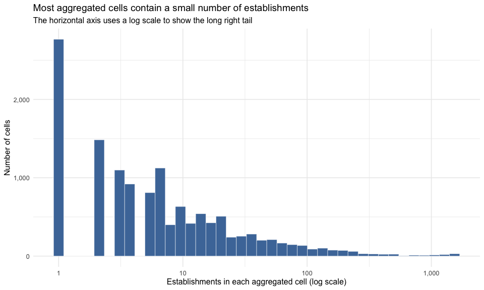
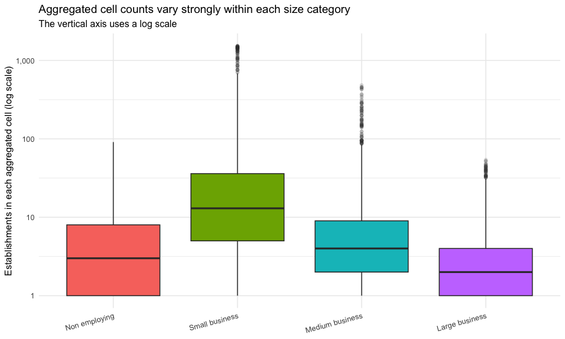
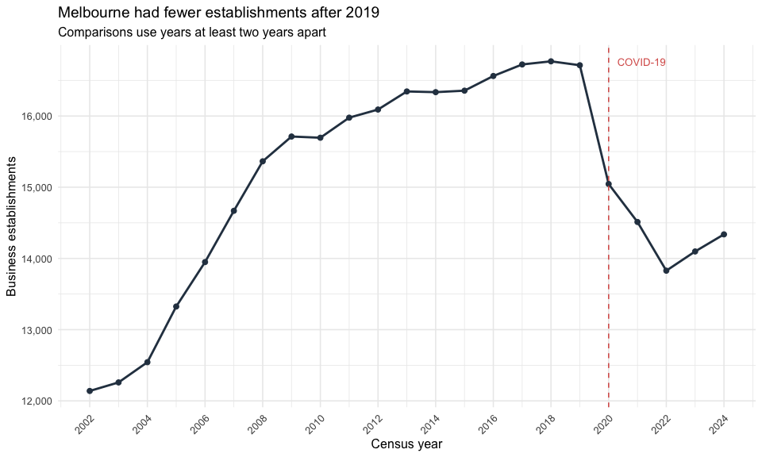
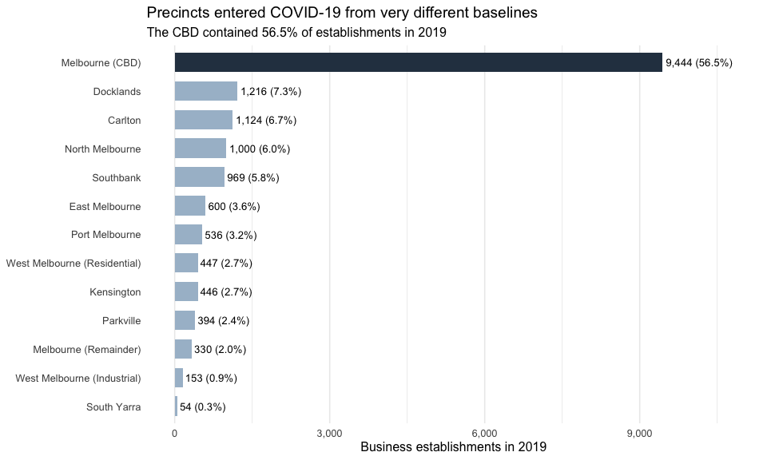
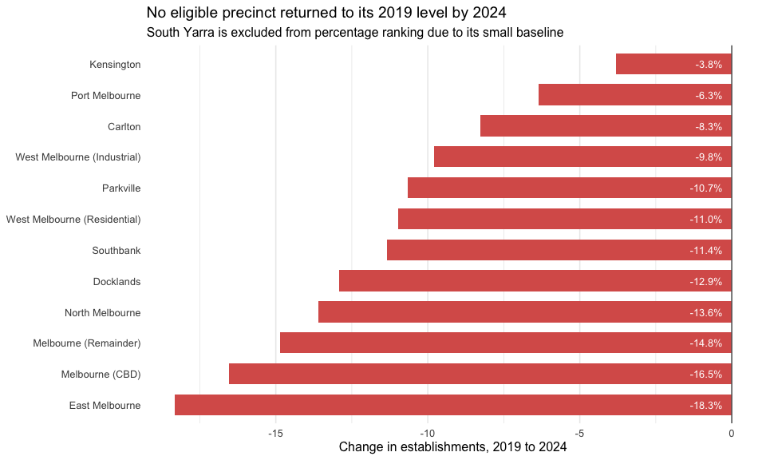
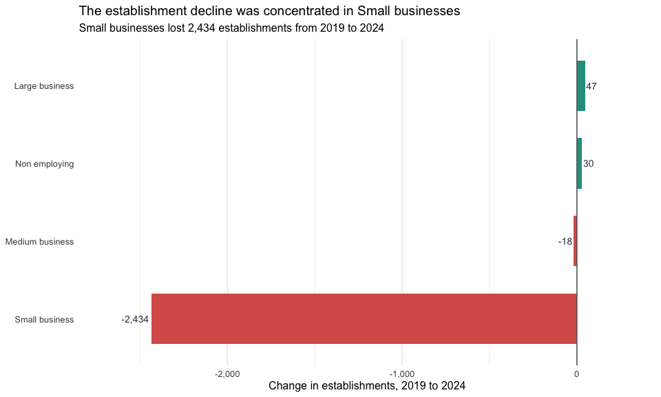
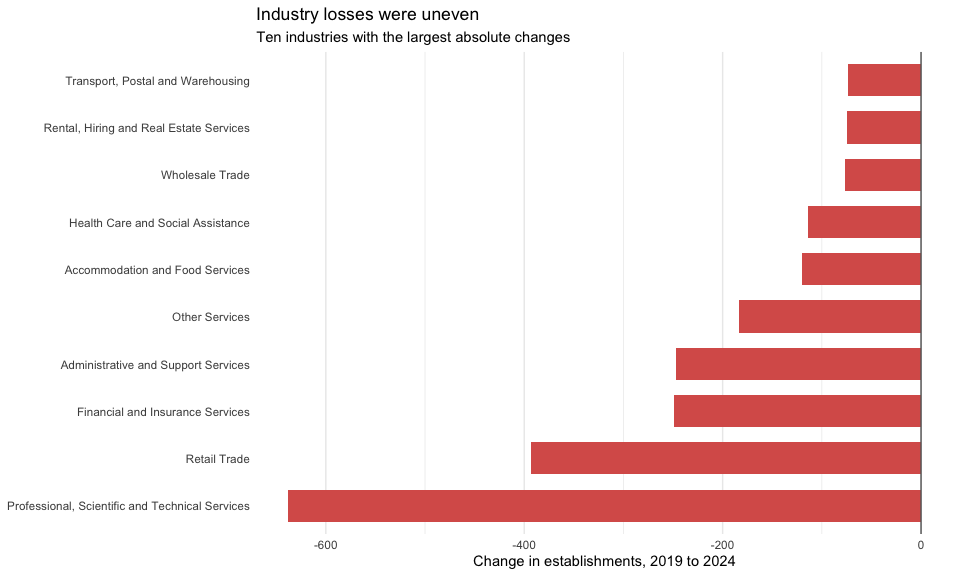

Melbourne Business Establishments: Descriptive Analytics
================
Group 10
27 August 2026

- [1. Research question and scope](#1-research-question-and-scope)
- [2. Import the two CLUE files](#2-import-the-two-clue-files)
  - [2.1 File overview](#21-file-overview)
- [3. Clean and validate the data](#3-clean-and-validate-the-data)
  - [3.1 Aggregated file](#31-aggregated-file)
  - [3.2 Location-level file](#32-location-level-file)
  - [3.3 Reconcile the two files](#33-reconcile-the-two-files)
- [4. Variables of interest](#4-variables-of-interest)
  - [4.1 Numerical variables](#41-numerical-variables)
  - [4.2 Categorical variables](#42-categorical-variables)
- [5. Summary statistics for key numerical
  variables](#5-summary-statistics-for-key-numerical-variables)
  - [5.1 Distribution of establishment counts across aggregated
    cells](#51-distribution-of-establishment-counts-across-aggregated-cells)
  - [5.2 Distribution by business
    size](#52-distribution-by-business-size)
- [6. Grouped descriptive statistics](#6-grouped-descriptive-statistics)
  - [6.1 City-wide totals by comparison
    year](#61-city-wide-totals-by-comparison-year)
  - [6.2 Precinct summary for 2019 and
    2024](#62-precinct-summary-for-2019-and-2024)
  - [6.3 Business-size summary for 2019 and
    2024](#63-business-size-summary-for-2019-and-2024)
  - [6.4 Industry summary for 2019 and
    2024](#64-industry-summary-for-2019-and-2024)
- [7. Visual analysis](#7-visual-analysis)
  - [7.1 Long-run city-wide establishment
    trend](#71-long-run-city-wide-establishment-trend)
  - [7.2 Precinct baseline before
    COVID-19](#72-precinct-baseline-before-covid-19)
  - [7.3 Precinct recovery gap, 2019 to
    2024](#73-precinct-recovery-gap-2019-to-2024)
  - [7.4 Change by business size](#74-change-by-business-size)
  - [7.5 Industries with the largest numerical
    changes](#75-industries-with-the-largest-numerical-changes)
- [8. Descriptive findings to carry
  forward](#8-descriptive-findings-to-carry-forward)
- [9. Limitations and next step](#9-limitations-and-next-step)
- [10. Reproducibility information](#10-reproducibility-information)

# 1. Research question and scope

**Research question:** How have small and medium-sized business
establishment patterns evolved across Melbourne precincts and industries
from 2002 to 2024, particularly around COVID-19?

This first-stage report is descriptive. It identifies what changed in
the CLUE data without claiming that COVID-19 caused every change.

Three interpretation rules apply:

1.  A CLUE establishment is a business location, not necessarily a
    unique legal enterprise.
2.  CLUE uses a two-year rolling survey cycle. The full annual series is
    shown for context, but substantive comparisons use years at least
    two years apart.
3.  Establishment count is the primary measure. Some job values are
    suppressed for confidentiality and are not imputed in this report.

# 2. Import the two CLUE files

The code works whether the CSV files are stored in the repository root
or in a `data/` folder.

``` r
# Look for the data in the standard repository data folder first, then fall
# back to the current or parent folder. This keeps the report portable when it
# is stored inside analysis/ and avoids computer-specific absolute paths.
data_candidates <- c("data", "../data", ".", "..")

DATA_DIR <- data_candidates[
  file.exists(file.path(
    data_candidates,
    "business-establishments-and-jobs-data-by-business-size-and-anzsic.csv"
  ))
][1]

if (is.na(DATA_DIR)) {
  stop("Data files not found. Place both supplied CSV files in the data/ folder.")
}

location_path <- file.path(
  DATA_DIR,
  "business-establishments-with-address-and-industry-classification.csv"
)

aggregate_path <- file.path(
  DATA_DIR,
  "business-establishments-and-jobs-data-by-business-size-and-anzsic.csv"
)

# Stop with a clear error if either required dataset is missing.
stopifnot(file.exists(location_path), file.exists(aggregate_path))

location_raw <- read_csv(location_path, show_col_types = FALSE)
aggregate_raw <- read_csv(aggregate_path, show_col_types = FALSE)
```

## 2.1 File overview

``` r
file_overview <- tibble(
  dataset = c("Location-level file", "Aggregated file"),
  rows = c(nrow(location_raw), nrow(aggregate_raw)),
  columns = c(ncol(location_raw), ncol(aggregate_raw))
)

kable(file_overview, format.args = list(big.mark = ","))
```

| dataset             |    rows | columns |
|:--------------------|--------:|--------:|
| Location-level file | 413,550 |      12 |
| Aggregated file     |  13,353 |       6 |

# 3. Clean and validate the data

## 3.1 Aggregated file

The aggregated file is the main source for establishment trends because
it contains consistent totals by year, precinct, industry and business
size.

``` r
aggregate <- aggregate_raw %>%
  rename(
    census_year = `Census year`,
    clue_small_area = `CLUE small area`,
    anzsic_industry = `ANZSIC indusrty`,
    business_size = `Business size`,
    total_establishments = `Total establishments`,
    total_jobs = `Total jobs`
  ) %>%
  mutate(
    census_year = as.integer(census_year),
    clue_small_area = as.factor(clue_small_area),
    anzsic_industry = as.factor(anzsic_industry),
    business_size = factor(
      business_size,
      levels = c(
        "Non employing",
        "Small business",
        "Medium business",
        "Large business"
      )
    ),
    total_establishments = as.numeric(total_establishments),
    total_jobs = as.numeric(total_jobs),
    jobs_suppressed = is.na(total_jobs)
  )

# These checks detect accidental changes to the supplied dataset or import.
stopifnot(
  nrow(aggregate) == 13353,
  n_distinct(aggregate$census_year) == 23,
  n_distinct(aggregate$clue_small_area) == 13,
  sum(is.na(aggregate$total_establishments)) == 0,
  sum(aggregate$jobs_suppressed) == 4252,
  sum(duplicated(aggregate)) == 0
)
```

## 3.2 Location-level file

The location-level file provides addresses, detailed ANZSIC
classifications and coordinates. It also contains records coded as
`Vacant Space`. These records are excluded from business counts because
they represent empty locations rather than operating establishments.

``` r
location <- location_raw %>%
  mutate(
    census_year = as.integer(census_year),
    is_vacant_space =
      industry_anzsic4_code == 0 &
      industry_anzsic4_description == "Vacant Space",
    is_operating = industry_anzsic4_code > 0
  )

location_operating <- location %>%
  filter(is_operating)

location_quality_check <- location %>%
  summarise(
    all_location_records = n(),
    vacant_space_records = sum(is_vacant_space),
    operating_records = sum(is_operating)
  )

kable(location_quality_check, format.args = list(big.mark = ","))
```

| all_location_records | vacant_space_records | operating_records |
|---------------------:|---------------------:|------------------:|
|              413,550 |               68,299 |           345,251 |

``` r
stopifnot(
  sum(location$is_vacant_space) == 68299,
  all(location$is_vacant_space == !location$is_operating),
  sum(duplicated(location)) == 0
)
```

The 68,299 Vacant Space observations are records across all 23 census
years. They are not 68,299 unique buildings and are not a current
vacancy count.

## 3.3 Reconcile the two files

``` r
location_yearly <- location %>%
  group_by(census_year) %>%
  summarise(
    operating_location_records = sum(is_operating),
    .groups = "drop"
  )

aggregate_yearly <- aggregate %>%
  group_by(census_year) %>%
  summarise(
    official_establishments = sum(total_establishments),
    .groups = "drop"
  )

reconciliation <- aggregate_yearly %>%
  left_join(location_yearly, by = "census_year") %>%
  mutate(
    difference = operating_location_records - official_establishments
  )

kable(
  reconciliation %>%
    filter(census_year %in% c(YEAR_PRE_COVID, YEAR_TROUGH, YEAR_LATEST)),
  format.args = list(big.mark = ",")
)
```

| census_year | official_establishments | operating_location_records | difference |
|------------:|------------------------:|---------------------------:|-----------:|
|       2,019 |                  16,713 |                     16,719 |          6 |
|       2,022 |                  13,828 |                     13,828 |          0 |
|       2,024 |                  14,338 |                     14,337 |         -1 |

``` r
# The two sources closely align after Vacant Space is removed. The small
# remaining difference never exceeds 25 records in any census year.
stopifnot(max(abs(reconciliation$difference)) <= 25)
```

# 4. Variables of interest

## 4.1 Numerical variables

``` r
numerical_variables <- tribble(
  ~variable, ~role, ~use_in_this_report,
  "census_year", "Time variable", "Long-run trend and comparison-year selection",
  "total_establishments", "Primary outcome", "Business establishment counts",
  "total_jobs", "Secondary outcome", "Reported only; missing values are not imputed",
  "longitude / latitude", "Spatial coordinates", "Reserved for later spatial analysis"
)

kable(numerical_variables)
```

| variable | role | use_in_this_report |
|:---|:---|:---|
| census_year | Time variable | Long-run trend and comparison-year selection |
| total_establishments | Primary outcome | Business establishment counts |
| total_jobs | Secondary outcome | Reported only; missing values are not imputed |
| longitude / latitude | Spatial coordinates | Reserved for later spatial analysis |

## 4.2 Categorical variables

``` r
categorical_variables <- tribble(
  ~variable, ~levels, ~use_in_this_report,
  "clue_small_area", n_distinct(aggregate$clue_small_area), "Precinct comparisons",
  "anzsic_industry", n_distinct(aggregate$anzsic_industry), "Industry comparisons",
  "business_size", n_distinct(aggregate$business_size), "Business-size comparisons",
  "industry_anzsic4_description",
  n_distinct(location_operating$industry_anzsic4_description),
  "Detailed industry checks in later analysis"
)

kable(categorical_variables)
```

| variable | levels | use_in_this_report |
|:---|---:|:---|
| clue_small_area | 13 | Precinct comparisons |
| anzsic_industry | 19 | Industry comparisons |
| business_size | 4 | Business-size comparisons |
| industry_anzsic4_description | 442 | Detailed industry checks in later analysis |

# 5. Summary statistics for key numerical variables

One row in the aggregated file is a year × precinct × industry ×
business-size cell. The following statistics describe these cells, not
individual businesses.

``` r
summary_statistics <- aggregate %>%
  summarise(
    cells = n(),
    establishment_mean = mean(total_establishments),
    establishment_median = median(total_establishments),
    establishment_sd = sd(total_establishments),
    establishment_min = min(total_establishments),
    establishment_max = max(total_establishments),
    jobs_reported_cells = sum(!jobs_suppressed),
    jobs_missing_cells = sum(jobs_suppressed),
    reported_jobs_mean = mean(total_jobs, na.rm = TRUE),
    reported_jobs_median = median(total_jobs, na.rm = TRUE)
  )

kable(
  summary_statistics,
  digits = 1,
  format.args = list(big.mark = ",")
)
```

| cells | establishment_mean | establishment_median | establishment_sd | establishment_min | establishment_max | jobs_reported_cells | jobs_missing_cells | reported_jobs_mean | reported_jobs_median |
|---:|---:|---:|---:|---:|---:|---:|---:|---:|---:|
| 13,353 | 25.9 | 5 | 106 | 1 | 1,538 | 9,101 | 4,252 | 979.4 | 167 |

The job summaries describe reported values only. The 4,252 blank job
cells are confidentiality suppressions associated with cells containing
one or two establishments; they are retained and not replaced with zero.

## 5.1 Distribution of establishment counts across aggregated cells

``` r
ggplot(aggregate, aes(total_establishments)) +
  geom_histogram(
    bins = 40,
    fill = COL_BLUE,
    colour = "white",
    linewidth = 0.2
  ) +
  scale_x_log10(labels = comma) +
  scale_y_continuous(labels = comma) +
  labs(
    title = "Most aggregated cells contain a small number of establishments",
    subtitle = "The horizontal axis uses a log scale to show the long right tail",
    x = "Establishments in each aggregated cell (log scale)",
    y = "Number of cells"
  ) +
  theme_minimal(base_size = 12)
```

<div class="figure" style="text-align: center">


<p class="caption">

Distribution of establishment counts across aggregated cells.
</p>

</div>

## 5.2 Distribution by business size

``` r
ggplot(aggregate, aes(business_size, total_establishments, fill = business_size)) +
  geom_boxplot(outlier.alpha = 0.15, show.legend = FALSE) +
  scale_y_log10(labels = comma) +
  labs(
    title = "Aggregated cell counts vary strongly within each size category",
    subtitle = "The vertical axis uses a log scale",
    x = NULL,
    y = "Establishments in each aggregated cell (log scale)"
  ) +
  theme_minimal(base_size = 12) +
  theme(axis.text.x = element_text(angle = 15, hjust = 1))
```

<div class="figure" style="text-align: center">


<p class="caption">

Cell-level establishment counts by business-size category.
</p>

</div>

# 6. Grouped descriptive statistics

## 6.1 City-wide totals by comparison year

``` r
city_year_summary <- aggregate %>%
  filter(census_year %in% c(YEAR_PRE_COVID, YEAR_TROUGH, YEAR_LATEST)) %>%
  group_by(census_year) %>%
  summarise(
    establishments = sum(total_establishments),
    reported_jobs = sum(total_jobs, na.rm = TRUE),
    suppressed_job_cells = sum(jobs_suppressed),
    .groups = "drop"
  )

kable(city_year_summary, format.args = list(big.mark = ","))
```

| census_year | establishments | reported_jobs | suppressed_job_cells |
|------------:|---------------:|--------------:|---------------------:|
|       2,019 |         16,713 |       458,888 |                  180 |
|       2,022 |         13,828 |       439,918 |                  198 |
|       2,024 |         14,338 |       485,604 |                  203 |

## 6.2 Precinct summary for 2019 and 2024

``` r
precinct_summary <- aggregate %>%
  filter(census_year %in% c(YEAR_PRE_COVID, YEAR_LATEST)) %>%
  group_by(census_year, clue_small_area) %>%
  summarise(
    establishments = sum(total_establishments),
    .groups = "drop"
  ) %>%
  pivot_wider(
    names_from = census_year,
    values_from = establishments,
    names_prefix = "est_"
  ) %>%
  mutate(
    change_count = est_2024 - est_2019,
    change_pct = pct_change(est_2024, est_2019),
    eligible_for_pct_ranking = est_2019 >= MIN_BASELINE_FOR_RANKING
  ) %>%
  arrange(change_pct)

kable(
  precinct_summary,
  digits = 1,
  format.args = list(big.mark = ",")
)
```

| clue_small_area | est_2019 | est_2024 | change_count | change_pct | eligible_for_pct_ranking |
|:---|---:|---:|---:|---:|:---|
| East Melbourne | 600 | 490 | -110 | -18.3 | TRUE |
| Melbourne (CBD) | 9,444 | 7,883 | -1,561 | -16.5 | TRUE |
| Melbourne (Remainder) | 330 | 281 | -49 | -14.8 | TRUE |
| North Melbourne | 1,000 | 864 | -136 | -13.6 | TRUE |
| Docklands | 1,216 | 1,059 | -157 | -12.9 | TRUE |
| Southbank | 969 | 859 | -110 | -11.4 | TRUE |
| West Melbourne (Residential) | 447 | 398 | -49 | -11.0 | TRUE |
| Parkville | 394 | 352 | -42 | -10.7 | TRUE |
| West Melbourne (Industrial) | 153 | 138 | -15 | -9.8 | TRUE |
| Carlton | 1,124 | 1,031 | -93 | -8.3 | TRUE |
| Port Melbourne | 536 | 502 | -34 | -6.3 | TRUE |
| Kensington | 446 | 429 | -17 | -3.8 | TRUE |
| South Yarra | 54 | 52 | -2 | -3.7 | FALSE |

## 6.3 Business-size summary for 2019 and 2024

``` r
size_summary <- aggregate %>%
  filter(census_year %in% c(YEAR_PRE_COVID, YEAR_LATEST)) %>%
  group_by(census_year, business_size) %>%
  summarise(
    establishments = sum(total_establishments),
    .groups = "drop"
  ) %>%
  pivot_wider(
    names_from = census_year,
    values_from = establishments,
    names_prefix = "est_"
  ) %>%
  mutate(
    change_count = est_2024 - est_2019,
    change_pct = pct_change(est_2024, est_2019)
  )

kable(
  size_summary,
  digits = 1,
  format.args = list(big.mark = ",")
)
```

| business_size   | est_2019 | est_2024 | change_count | change_pct |
|:----------------|---------:|---------:|-------------:|-----------:|
| Non employing   |      828 |      858 |           30 |        3.6 |
| Small business  |   12,641 |   10,207 |       -2,434 |      -19.3 |
| Medium business |    2,865 |    2,847 |          -18 |       -0.6 |
| Large business  |      379 |      426 |           47 |       12.4 |

## 6.4 Industry summary for 2019 and 2024

``` r
industry_summary <- aggregate %>%
  filter(census_year %in% c(YEAR_PRE_COVID, YEAR_LATEST)) %>%
  group_by(census_year, anzsic_industry) %>%
  summarise(
    establishments = sum(total_establishments),
    .groups = "drop"
  ) %>%
  pivot_wider(
    names_from = census_year,
    values_from = establishments,
    names_prefix = "est_"
  ) %>%
  mutate(
    change_count = est_2024 - est_2019,
    change_pct = pct_change(est_2024, est_2019)
  ) %>%
  arrange(change_count)

kable(
  industry_summary,
  digits = 1,
  format.args = list(big.mark = ",")
)
```

| anzsic_industry | est_2019 | est_2024 | change_count | change_pct |
|:---|---:|---:|---:|---:|
| Professional, Scientific and Technical Services | 2,770 | 2,132 | -638 | -23.0 |
| Retail Trade | 2,263 | 1,870 | -393 | -17.4 |
| Financial and Insurance Services | 970 | 721 | -249 | -25.7 |
| Administrative and Support Services | 604 | 357 | -247 | -40.9 |
| Other Services | 1,603 | 1,419 | -184 | -11.5 |
| Accommodation and Food Services | 3,153 | 3,033 | -120 | -3.8 |
| Health Care and Social Assistance | 1,167 | 1,053 | -114 | -9.8 |
| Wholesale Trade | 381 | 304 | -77 | -20.2 |
| Rental, Hiring and Real Estate Services | 483 | 408 | -75 | -15.5 |
| Transport, Postal and Warehousing | 314 | 240 | -74 | -23.6 |
| Construction | 395 | 323 | -72 | -18.2 |
| Manufacturing | 481 | 436 | -45 | -9.4 |
| Information Media and Telecommunications | 252 | 213 | -39 | -15.5 |
| Public Administration and Safety | 305 | 279 | -26 | -8.5 |
| Education and Training | 676 | 661 | -15 | -2.2 |
| Arts and Recreation Services | 650 | 638 | -12 | -1.8 |
| Mining | 37 | 27 | -10 | -27.0 |
| Agriculture, Forestry and Fishing | 17 | 10 | -7 | -41.2 |
| Electricity, Gas, Water and Waste Services | 192 | 214 | 22 | 11.5 |

# 7. Visual analysis

## 7.1 Long-run city-wide establishment trend

The annual points show the published series. They are used to describe
the long-run shape, not to estimate year-on-year entry or exit.

``` r
city_trend <- aggregate %>%
  group_by(census_year) %>%
  summarise(
    establishments = sum(total_establishments),
    .groups = "drop"
  )

ggplot(city_trend, aes(census_year, establishments)) +
  geom_line(linewidth = 1, colour = COL_DARK) +
  geom_point(size = 2, colour = COL_DARK) +
  geom_vline(
    xintercept = 2020,
    linetype = "dashed",
    colour = COL_NEGATIVE
  ) +
  annotate(
    "text",
    x = 2020.3,
    y = max(city_trend$establishments),
    label = "COVID-19",
    hjust = 0,
    colour = COL_NEGATIVE,
    size = 3.5
  ) +
  scale_x_continuous(breaks = seq(2002, 2024, 2)) +
  scale_y_continuous(labels = comma) +
  labs(
    title = "Melbourne had fewer establishments after 2019",
    subtitle = "Comparisons use years at least two years apart",
    x = "Census year",
    y = "Business establishments"
  ) +
  theme_minimal(base_size = 12) +
  theme(axis.text.x = element_text(angle = 45, hjust = 1))
```

<div class="figure" style="text-align: center">


<p class="caption">

City-wide establishment trend, 2002–2024.
</p>

</div>

## 7.2 Precinct baseline before COVID-19

``` r
precinct_baseline <- aggregate %>%
  filter(census_year == YEAR_PRE_COVID) %>%
  group_by(clue_small_area) %>%
  summarise(
    establishments = sum(total_establishments),
    .groups = "drop"
  ) %>%
  mutate(
    city_share = establishments / sum(establishments),
    emphasis = if_else(
      clue_small_area == "Melbourne (CBD)",
      "CBD",
      "Other precincts"
    ),
    label = paste0(comma(establishments), " (", percent(city_share, 0.1), ")")
  )

ggplot(
  precinct_baseline,
  aes(
    establishments,
    fct_reorder(clue_small_area, establishments),
    fill = emphasis
  )
) +
  geom_col(width = 0.68) +
  geom_text(aes(label = label), hjust = -0.05, size = 3.5) +
  scale_fill_manual(
    values = c("CBD" = COL_DARK, "Other precincts" = COL_LIGHT_BLUE),
    guide = "none"
  ) +
  scale_x_continuous(labels = comma, limits = c(0, 10800)) +
  labs(
    title = "Precincts entered COVID-19 from very different baselines",
    subtitle = "The CBD contained 56.5% of establishments in 2019",
    x = "Business establishments in 2019",
    y = NULL
  ) +
  theme_minimal(base_size = 12) +
  theme(panel.grid.major.y = element_blank())
```

<div class="figure" style="text-align: center">


<p class="caption">

Precinct establishment counts in 2019.
</p>

</div>

## 7.3 Precinct recovery gap, 2019 to 2024

South Yarra is shown in the summary table but excluded from this
percentage ranking because its 2019 baseline was only 54 establishments.

``` r
precinct_rank <- precinct_summary %>%
  filter(eligible_for_pct_ranking)

ggplot(
  precinct_rank,
  aes(
    change_pct,
    fct_reorder(clue_small_area, change_pct)
  )
) +
  geom_col(fill = COL_NEGATIVE, width = 0.68) +
  geom_vline(xintercept = 0, colour = "grey40") +
  geom_text(
    aes(
      x = -0.3,
      label = percent(change_pct / 100, accuracy = 0.1)
    ),
    hjust = 1,
    colour = "white",
    size = 3.4
  ) +
  labs(
    title = "No eligible precinct returned to its 2019 level by 2024",
    subtitle = "South Yarra is excluded from percentage ranking due to its small baseline",
    x = "Change in establishments, 2019 to 2024",
    y = NULL
  ) +
  theme_minimal(base_size = 12) +
  theme(panel.grid.major.y = element_blank())
```

<div class="figure" style="text-align: center">


<p class="caption">

Percentage change in establishments by precinct, excluding baselines
below 100.
</p>

</div>

## 7.4 Change by business size

``` r
ggplot(
  size_summary,
  aes(change_count, fct_reorder(business_size, change_count))
) +
  geom_col(
    aes(fill = change_count >= 0),
    width = 0.65,
    show.legend = FALSE
  ) +
  geom_vline(xintercept = 0, colour = "grey40") +
  geom_text(
    aes(
      label = comma(change_count),
      hjust = if_else(change_count < 0, 1.1, -0.1)
    ),
    colour = COL_DARK,
    size = 3.7
  ) +
  scale_fill_manual(
    values = c("TRUE" = COL_POSITIVE, "FALSE" = COL_NEGATIVE)
  ) +
  scale_x_continuous(
    labels = comma,
    limits = c(-2700, 300)
  ) +
  labs(
    title = "The establishment decline was concentrated in Small businesses",
    subtitle = "Small businesses lost 2,434 establishments from 2019 to 2024",
    x = "Change in establishments, 2019 to 2024",
    y = NULL
  ) +
  theme_minimal(base_size = 12) +
  theme(panel.grid.major.y = element_blank())
```

<div class="figure" style="text-align: center">


<p class="caption">

Change in establishment counts by business size, 2019–2024.
</p>

</div>

## 7.5 Industries with the largest numerical changes

``` r
industry_plot_data <- industry_summary %>%
  slice_max(abs(change_count), n = 10, with_ties = FALSE)

ggplot(
  industry_plot_data,
  aes(change_count, fct_reorder(anzsic_industry, change_count))
) +
  geom_col(
    aes(fill = change_count >= 0),
    width = 0.68,
    show.legend = FALSE
  ) +
  geom_vline(xintercept = 0, colour = "grey40") +
  scale_fill_manual(
    values = c("TRUE" = COL_POSITIVE, "FALSE" = COL_NEGATIVE)
  ) +
  scale_x_continuous(labels = comma) +
  labs(
    title = "Industry losses were uneven",
    subtitle = "Ten industries with the largest absolute changes",
    x = "Change in establishments, 2019 to 2024",
    y = NULL
  ) +
  theme_minimal(base_size = 11) +
  theme(panel.grid.major.y = element_blank())
```

<div class="figure" style="text-align: center">


<p class="caption">

Industries with the largest absolute establishment changes, 2019–2024.
</p>

</div>

# 8. Descriptive findings to carry forward

``` r
city_change <- city_year_summary %>%
  filter(census_year %in% c(YEAR_PRE_COVID, YEAR_LATEST)) %>%
  arrange(census_year) %>%
  summarise(
    change_count = establishments[2] - establishments[1],
    change_pct = pct_change(establishments[2], establishments[1])
  )

headline_findings <- tibble(
  finding = c(
    paste0(
      "City-wide establishments changed by ",
      comma(city_change$change_count),
      " (",
      percent(city_change$change_pct / 100, accuracy = 0.1),
      ") between 2019 and 2024."
    ),
    "No precinct with a 2019 baseline of at least 100 establishments returned to its 2019 level by 2024.",
    "Small businesses lost 2,434 establishments, more than the total city-wide net decline.",
    "Large businesses increased by 47 establishments, partly offsetting the Small-business decline.",
    "The industry results show uneven establishment changes and should be examined by precinct in the next stage."
  )
)

kable(headline_findings, col.names = "Finding")
```

| Finding |
|:---|
| City-wide establishments changed by -2,375 (-14.2%) between 2019 and 2024. |
| No precinct with a 2019 baseline of at least 100 establishments returned to its 2019 level by 2024. |
| Small businesses lost 2,434 establishments, more than the total city-wide net decline. |
| Large businesses increased by 47 establishments, partly offsetting the Small-business decline. |
| The industry results show uneven establishment changes and should be examined by precinct in the next stage. |

# 9. Limitations and next step

- The analysis identifies patterns but does not establish causal effects
  of COVID-19.
- Job values are incomplete because CLUE suppresses cells with one or
  two establishments. This report does not impute them.
- Percentage rankings exclude precincts with fewer than 100
  establishments in 2019, although those precincts remain in the
  underlying tables.
- The next stage should test precinct × industry × business-size
  patterns using multi-year comparison points, rather than year-on-year
  entry or exit rates.

# 10. Reproducibility information

``` r
sessionInfo()
```

    ## R version 4.5.3 (2026-03-11)
    ## Platform: aarch64-apple-darwin20
    ## Running under: macOS Tahoe 26.6.2
    ## 
    ## Matrix products: default
    ## BLAS:   /Library/Frameworks/R.framework/Versions/4.5-arm64/Resources/lib/libRblas.0.dylib 
    ## LAPACK: /Library/Frameworks/R.framework/Versions/4.5-arm64/Resources/lib/libRlapack.dylib;  LAPACK version 3.12.1
    ## 
    ## locale:
    ## [1] C.UTF-8/C.UTF-8/C.UTF-8/C/C.UTF-8/C.UTF-8
    ## 
    ## time zone: Australia/Melbourne
    ## tzcode source: internal
    ## 
    ## attached base packages:
    ## [1] stats     graphics  grDevices utils     datasets  methods   base     
    ## 
    ## other attached packages:
    ##  [1] knitr_1.51      scales_1.4.0    lubridate_1.9.5 forcats_1.0.1  
    ##  [5] stringr_1.6.0   dplyr_1.2.0     purrr_1.2.1     readr_2.2.0    
    ##  [9] tidyr_1.3.2     tibble_3.3.1    ggplot2_4.0.2   tidyverse_2.0.0
    ## 
    ## loaded via a namespace (and not attached):
    ##  [1] bit_4.6.0          gtable_0.3.6       crayon_1.5.3       compiler_4.5.3    
    ##  [5] tidyselect_1.2.1   parallel_4.5.3     yaml_2.3.12        fastmap_1.2.0     
    ##  [9] R6_2.6.1           labeling_0.4.3     generics_0.1.4     pillar_1.11.1     
    ## [13] RColorBrewer_1.1-3 tzdb_0.5.0         rlang_1.1.7        stringi_1.8.7     
    ## [17] xfun_0.56          S7_0.2.1           bit64_4.6.0-1      otel_0.2.0        
    ## [21] timechange_0.4.0   cli_3.6.5          withr_3.0.2        magrittr_2.0.4    
    ## [25] digest_0.6.39      grid_4.5.3         vroom_1.7.0        hms_1.1.4         
    ## [29] lifecycle_1.0.5    vctrs_0.7.1        evaluate_1.0.5     glue_1.8.0        
    ## [33] farver_2.1.2       rmarkdown_2.30     tools_4.5.3        pkgconfig_2.0.3   
    ## [37] htmltools_0.5.9
